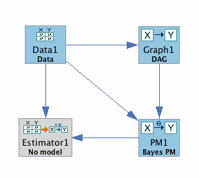
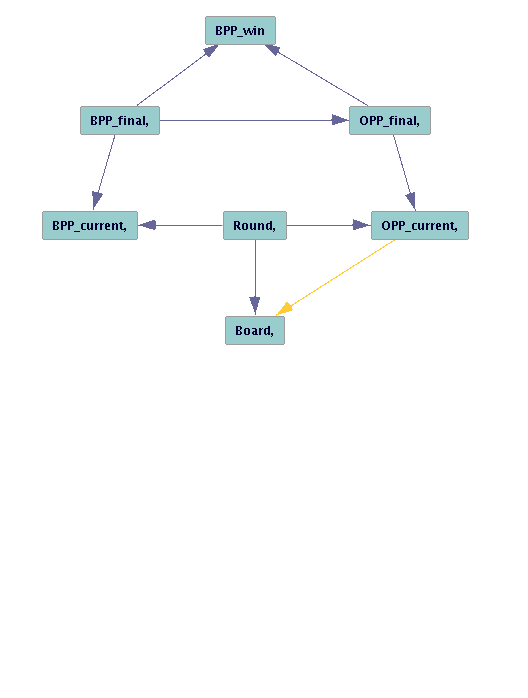

# Workflow for Learning Netowrk's Parameters with Tetrad

1. Data1 Data: File / Load Data (check 'discrete data', delimiter: 'comma')
2. Graph1: Choose Dag in Pattern, construct the graph as shown below
3. PM1: Choose Bayes Parametric Model, and fix missing discrete values
4. Estimator1: Run an ML Bayes estimator.

