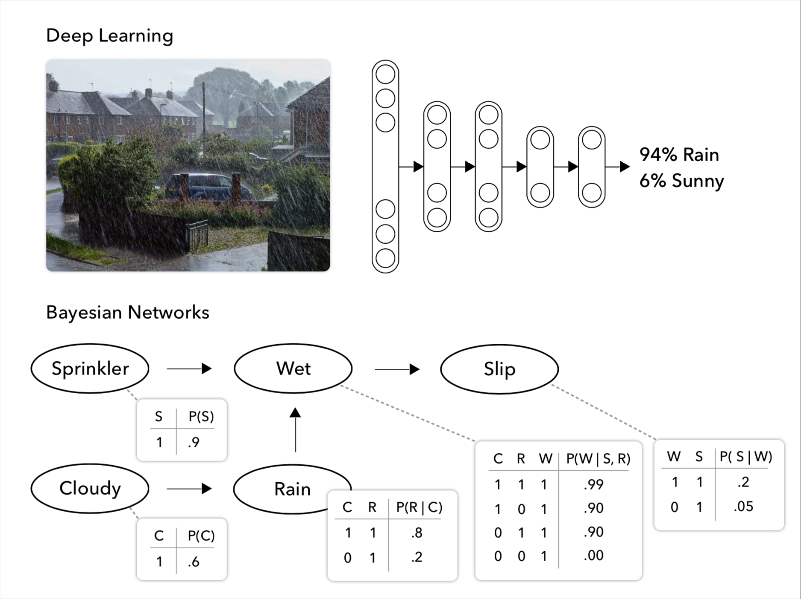
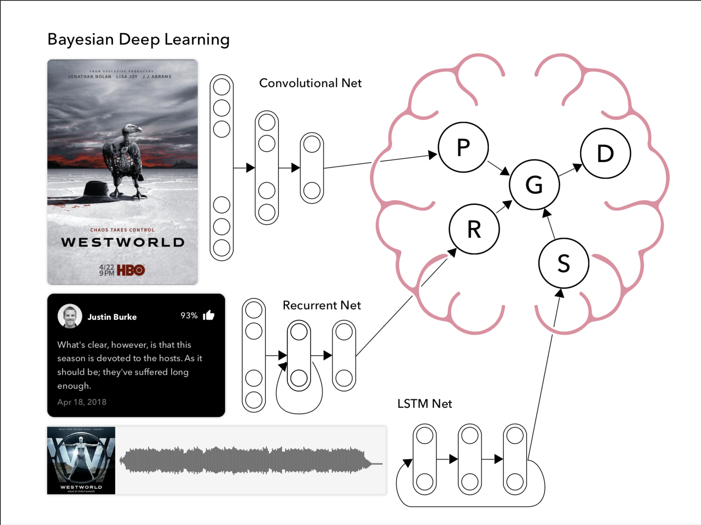

# SURP-2018
> Presently, there are two major frontiers in artificial intelligent (AI) research that each possess their own strengths and weaknesses in pursuit of designing dynamic artificial agents: (1) Causal Inference (CI) is a model-building approach that allows artificial agents to make decisions using observational, interventional, and even counterfactual reasoning (giving them much expressive power), but is a budding exploration in AI lacking a prescription for modeling high-dimensional data (such as image processing). (2) Deep learning (DL) techniques, on the other hand, are model- free and well suited to tasks with high-dimensional inputs / outputs, but operate solely in the realm of associational reasoning. In brief, CI is interpretable, but lacks procedures for high-dimensional processing; DL is strong in high-dimensional processing but lacks interpretability. As such, the present project attempts to create a new technique that fuses the strengths of CI and DL in what we refer to as a Causal Cognitive Network (CCN, working title). CI employs graphical models to encode the causal assumptions of a system, whereas DL employs artificial neural networks (ANN) to encode the associational relationships of a system. CCNs will represent a structured graph of ANNs by which the functional relationships between variables in a graphical causal model are encoded as neural networks instead. Once formalized, and a working prototype of a CCN is developed, the project will continue by determining if a CCN can navigate problems common to CI (e.g., whether they maintain an interventional calculus), problems common to DL (e.g., image processing), and potentially new problems that neither field has been able to address (e.g., meta-cognitive models capable of self-amendment). This research will attempt to marry two disciplines at the forefront of AI research whose camps have yet to seriously meet.

