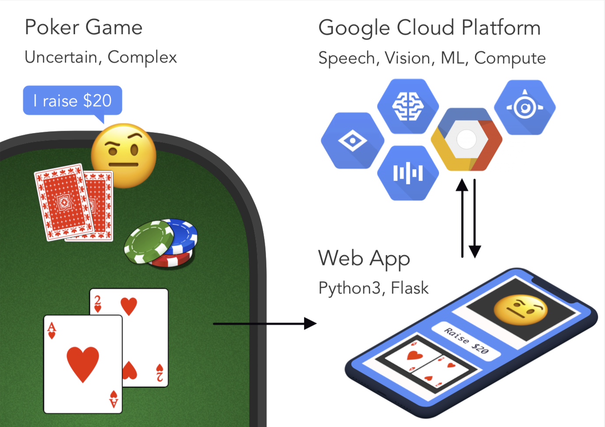
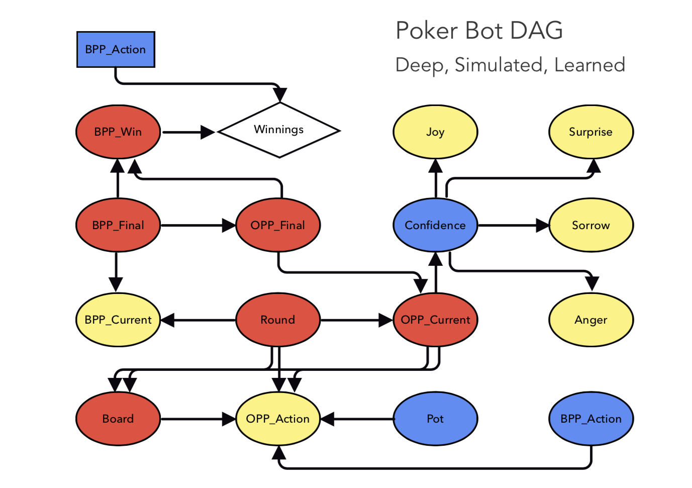

# Training a BDN to play Texas Hold'em Poker
The aim of this program is to recreate the Bayesian Decision Network specified in the paper by Ann E. Nicholson, and train it using the publicly accessible dataset by Michael Maurer. Relevant information can be found below.

Paper: [Using Bayesian Decision Networks to Play Texas Hold'em Poker](https://www.researchgate.net/publication/228343776_Using_Bayesian_Decision_Networks_to_Play_Texas_Hold%27em_Poker?enrichId=rgreq-7aa589c1fabee2d157fca7791551d4c0-XXX&enrichSource=Y292ZXJQYWdlOzIyODM0Mzc3NjtBUzoxMDY2NjcxODYzMjc1NTJAMTQwMjQ0Mjg0NzA0OQ%3D%3D&el=1_x_3&_esc=publicationCoverPdf)
Dataset: [Michael Maurer's IRC Poker Database](http://poker.cs.ualberta.ca/irc_poker_database.html)
Dataset Explained: [archive.today](http://archive.li/7ztYP)

## The Network

| Node Shape  | Node Type |
| ----------- | --------- |
| Oval        | Standard  |
| Diamond     | Utility   |
| Rectangular | Desision  |

| Node Label | Meaning | States |
| --- | --- | --- |
| (Round)o | Current round in Texas Hold'em | pre-flop (0), flop (1), turn (2), river (3) |
| (OPP Final) | Opponent' final hand type after the river | [1-17] |
| (BPP_win) | Whether or not Bayesian Player will win | Lost (0), Win (1) |
| (BPP_final)o | Bayesian Player final hand type | [1-17] |
| (BPP_current)o | Bayesian Player current hand type | [1-17] |
| (OPP_current) | Opponent's current hand type | [1-17] |
| (OPP_action)o | Opponent's action | fold (f), call (c), raise (r), check (k), bet (b), paysmallblind (B), paybigblind (B), pass (p) |
| (Board)o | State of the board at a particular stage | [1-17] |
| (Pot)o | Value of the pot at a particular stage | 0, B, 2B, ..., 10B** |
| [BPP_action] | most recient BP action | fold (f), call (c), raise (r), check (k), bet (b), paysmallblind (B), paybigblind (B), pass (p) |

`o` indicates that the variable is observed

\* We opted for a modest additional refinement, moving from 9 hand types to 17 types, subdividing the busted hands into busted-low (9 high or lower), busted-medium (10 or J high), busted-queen, busted-king and busted-ace; we subdivided pairs likewise. We name this categories 0 to 16 in increasing order of strength.

\*\* `B` is the value of the small blind, anything higher than 10B will be clipped.

## Learning

Notice that if we ignore the nodes (OPP action), (BPP action) and (Pot), the remainder of the model's parameters can be trained from randomly generated games of poker. The rest of the graph can be added later using data from real players. In addition, this later part can be refined during gameplay to account for the opponent's strategy

## Making betting decision
Given an estimate of the probability of winning, it remains to make betting decisions.